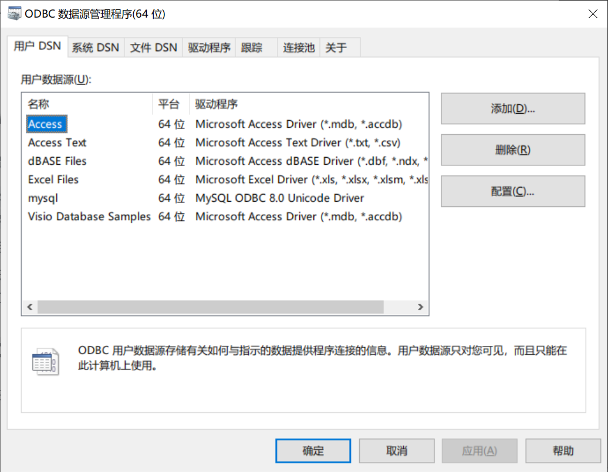

# 星云平台桌面客户端

## 安装

1. Qt 5.15.2
2. MySQL 5.7
3. MySQL Workbench 5.7

## Windows编译报错

如果控制台出现错误提示`QSqlDatabase: QMYSQL driver not loaded`，采用以下步骤解决

1. 从 `[MySQL安装目录]\lib` 中将 `libmysql.dll` 文件复制 `[Qt安装目录]\5.15.2\mingw81_64\bin` 中，可能因为qt和mingw版本不同文件夹名有所变化。
2. 将本项目文件夹`sqldrivers`复制到`[Qt安装目录]\5.15.2\mingw81_64\plugins\`
3. 若仍然无效，按照https://blog.csdn.net/zxl_1996/article/details/104299715 自行编译Qt对应版本的驱动

## 无法导出Excel？

打开ODBC数据源管理程序，检查是否有Excel驱动：

如果没有，安装驱动： https://www.microsoft.com/zh-cn/download/details.aspx?id=54920

